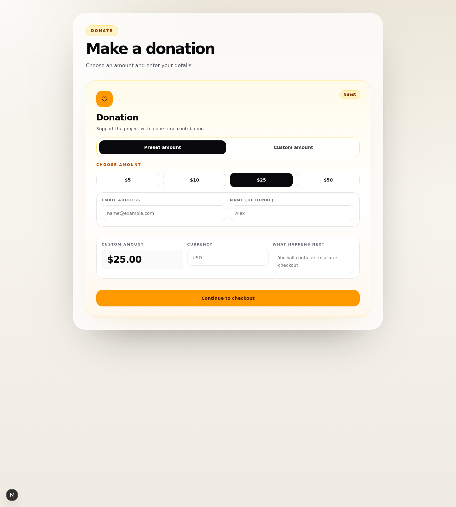

# Stripe Integration - Drupal donation flow for anonymous and logged-in users

## Related issues
- Parent FE umbrella: #366
- Backend scope: #359

## Summary
Implement the dedicated Drupal donation flow that supports both anonymous users and logged-in users, creates a backend donation checkout session, and redirects to Stripe Checkout.

## Mockup

## Scope
- [ ] Render donation form/component on the dedicated donation page
- [ ] Support anonymous donation
- [ ] Support logged-in donation
- [ ] Support preset amounts and custom amount
- [ ] Validate the amount before backend submission
- [ ] Submit donation request to backend and redirect to Stripe Checkout

## Fields and controls
- [ ] Donation mode selector: radio group with `Preset amount` and `Custom amount`
- [ ] Preset amount choices: button group or radio cards
- [ ] Custom amount field: numeric input
- [ ] Currency display: read-only
- [ ] Donor email field for anonymous donation flow
- [ ] Optional donor name field
- [ ] CTA button: `Donate securely`

## Validation rules
- [ ] Amount is required
- [ ] Amount must be submitted in integer minor units
- [ ] Amount must meet backend minimum
- [ ] Email is required and must be valid for anonymous donation
- [ ] Email is optional for authenticated donation
- [ ] Donor name length validation

## Submission behavior
- [ ] Send `paymentType = donation`
- [ ] Send amount in integer minor units together with currency
- [ ] Send donor fields defined in the backend contract
- [ ] Disable CTA during request
- [ ] Prevent duplicate submits
- [ ] Show non-sensitive error on failure
- [ ] Redirect to Stripe Checkout on success

## Acceptance criteria
- [ ] Anonymous user can start donation checkout
- [ ] Logged-in user can start donation checkout
- [ ] Preset amount selection works
- [ ] Custom amount entry works
- [ ] Validation errors are shown before submission
- [ ] Frontend creates donation checkout session through backend and redirects to Stripe

- Keep donation UX lightweight
- Avoid collecting unnecessary personal data in anonymous flow
