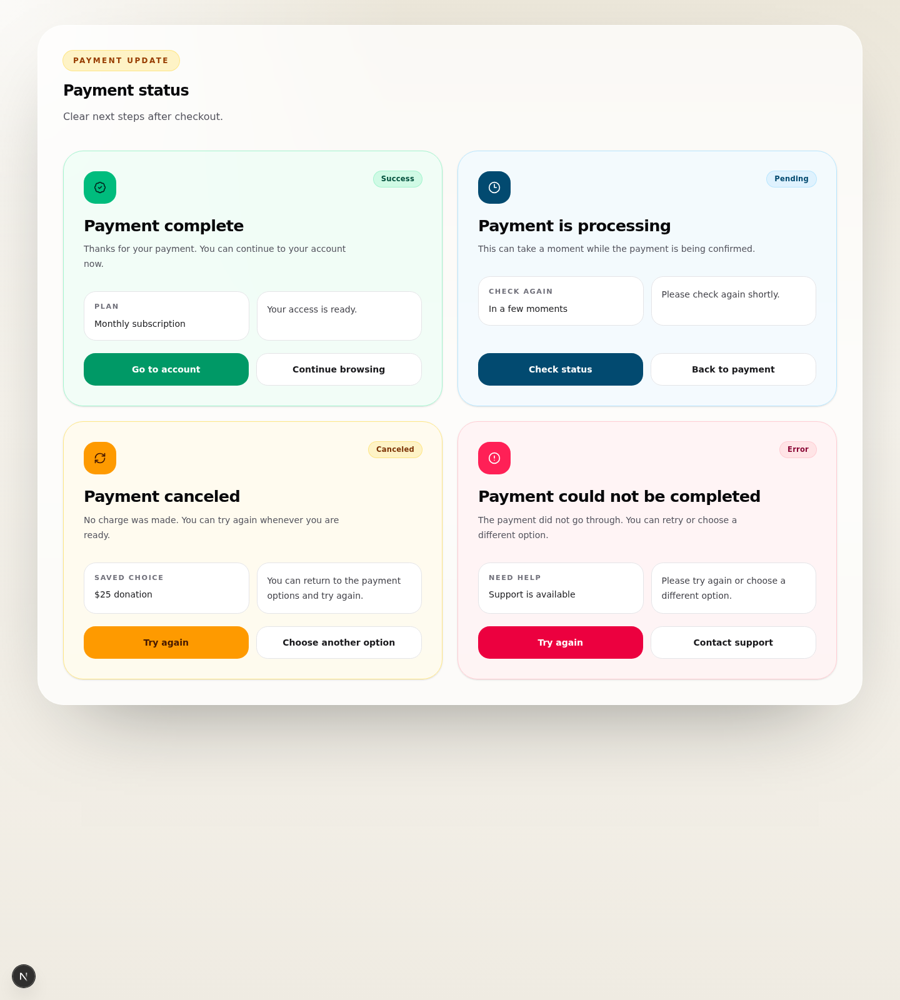

# Stripe Integration - Drupal payment result pages and backend-confirmed status handling

## Related issues
- Parent FE umbrella: #366
- Backend scope: #359

## Summary
Implement Drupal result pages and status messaging for Stripe payment flows. These pages are informational only and must reflect backend-confirmed state rather than redirect state alone.

## Mockup

## Scope
- [ ] Success page
- [ ] Cancel page
- [ ] Pending/processing page
- [ ] Generic payment error state
- [ ] Retry and navigation actions back into the product flow
- [ ] Backend-confirmed status lookup after return from Stripe

## Shared rules
- [ ] All post-checkout result pages use backend-confirmed status lookup
- [ ] Frontend uses `sessionReference` and `statusToken` after return from Stripe to resolve current result state
- [ ] Redirect context may start the lookup flow, but it does not determine final result state

## Page requirements
### Success page
- [ ] Show success heading
- [ ] Show payment type label
- [ ] Show short confirmation copy
- [ ] Show next-step guidance
- [ ] Show navigation button back to account, dashboard, or home
- [ ] Show transaction/plan/amount details when backend returns safe display data
- [ ] Render success state only when backend-confirmed status resolves to successful outcome

### Cancel page
- [ ] Show cancel heading
- [ ] Explain that payment was not completed
- [ ] Show retry button
- [ ] Show navigation back to pricing or donation page
- [ ] Use backend-confirmed status lookup before rendering final cancel or retry state

### Pending page
- [ ] Show processing heading
- [ ] Explain that backend confirmation may still be in progress
- [ ] Show refresh action
- [ ] Use backend-confirmed status lookup with `sessionReference` and `statusToken`

### Error state
- [ ] Show generic error heading
- [ ] Show safe non-sensitive error message
- [ ] Show retry CTA
- [ ] Show support link/contact

## Acceptance criteria
- [ ] All payment flows can land on a clear post-checkout Drupal state
- [ ] Frontend never marks payment success from redirect state alone
- [ ] User has a clear retry or navigation path from cancel/error states
- [ ] Pending state communicates webhook/backend processing clearly
- [ ] Anonymous post-checkout flows use backend-confirmed status lookup protected by `statusToken`
- [ ] All result states are rendered from backend-confirmed status rather than redirect-only state
