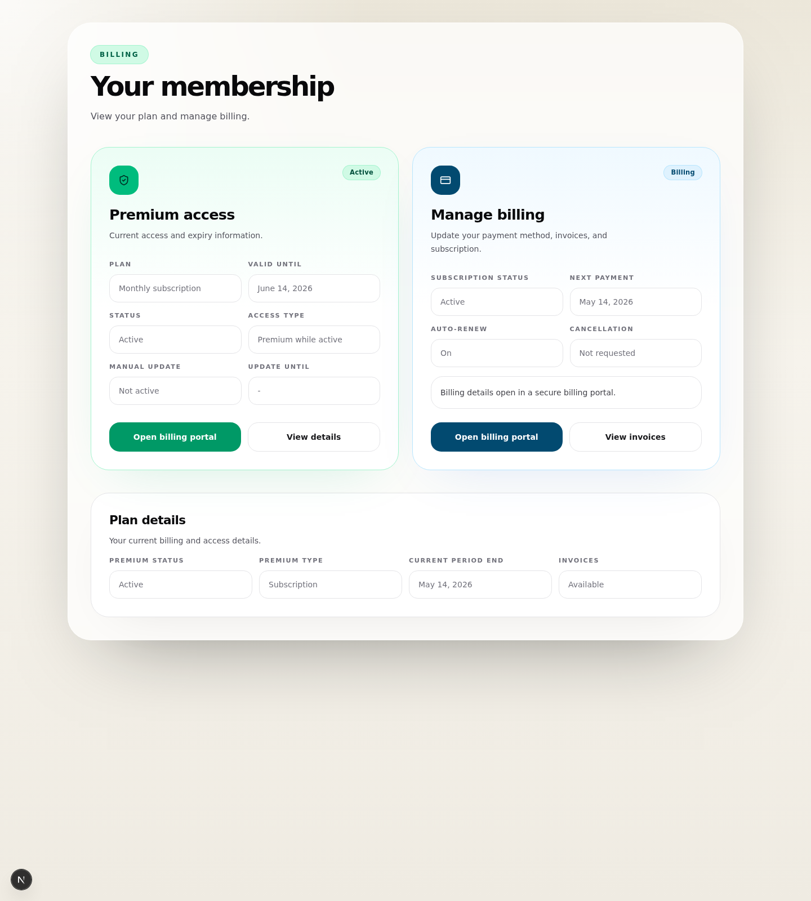

# Stripe Integration - Drupal account summary and Stripe-hosted management

## Related issues
- Parent FE umbrella: #366
- Backend scope: #359

## Summary
Implement the logged-in user account area needed to display current premium and subscription state in Drupal, with Stripe-hosted management for billing details.

## Mockup

## Scope
- [ ] Add a payment/account section in Drupal for authenticated users
- [ ] Show premium access summary
- [ ] Show subscription summary
- [ ] Show Stripe-hosted billing management entry point
- [ ] Keep the Drupal account view compact

## UI requirements
### Summary cards / summary block
- [ ] Premium access status
- [ ] Premium access type
- [ ] Premium valid-until or expiry date
- [ ] Premium manual-override state indicator if active
- [ ] Premium override effective-until
- [ ] Subscription status
- [ ] Current period end / renewal date
- [ ] Auto-renew or cancellation-at-period-end status
- [ ] Cancellation requested state

### Stripe-hosted management entry point
- [ ] Button or link to Stripe-hosted billing management
- [ ] Clear label that billing details open in Stripe
- [ ] Show current billing status before opening Stripe

## Status mapping
- [ ] Map backend status values to user-friendly labels
- [ ] Do not expose raw Stripe object details directly in UI

## Acceptance criteria
- [ ] Logged-in user can see current premium/subscription state
- [ ] Logged-in user can open Stripe-hosted billing management
- [ ] Drupal account view stays compact and summary-focused
- [ ] Status labels are understandable to end users
